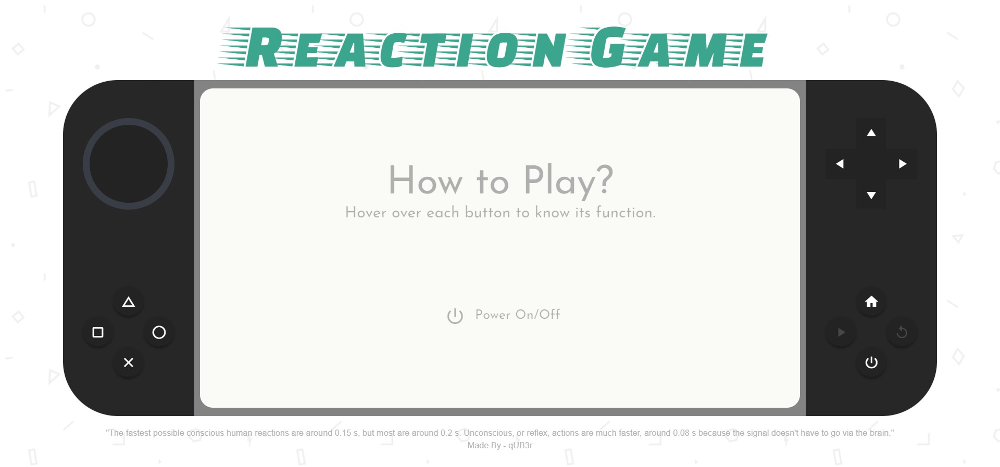

# Reaction Game

Click [here](https://reaction-game-001-app.herokuapp.com/) to try it now.

> If the site does not load on first attempt then either refresh the page or try again to access the link. It is because the site with low traffic on Heroku is pulled down to save server usage

To try it locally enter the following commands in the command line

> Make sure your system has Node.js installed

```sh
cd <any_directory>
git clone https://github.com/qUB3r-001/Reaction-Game.git
cd Reaction-Game
npm install
npm run serve
```

## About

Inspired from handheld gaming consoles including 2 modes: Reaction Time and Aim Trainer.

- Build in Vue.js@2.6.12.
- Used Quasar for all components and styling.
- All animations are done using CSS/SCSS and JavaScript.



#### Reaction Time

- Click on the screen when Green color appears.(Game would end if clicked on Red screen)
- Average of 5 attempts would be considered.

#### Aim Trainer

- Click on the Target as many time as possible before the time runs out.
- Target is divided in 4 regions:
  - Innermost ring - 10 Points
  - 2nd Innermost ring - 5 Points
  - 3rd Innermost ring - 2 Points
  - Outermost ring - 1 Point

GLHF ;)
